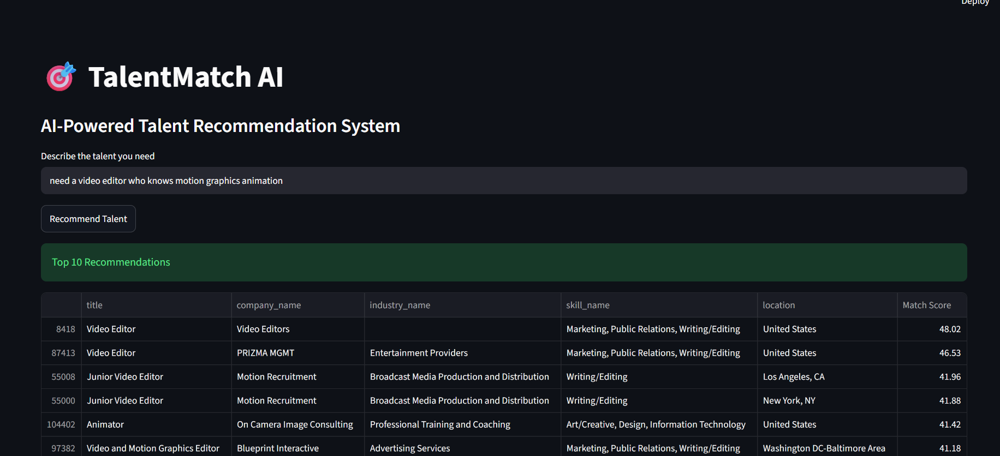

# TalentProfile AI ? Universal Talent Recommendation System

TalentProfile AI is a recruiter-focused AI talent discovery engine that transforms natural-language job specifications, recruiter queries, and skill requirements into ranked, explainable candidate and talent profiles across 123,800+ real-world profiles.

## Demo

  

---

## ?? Problem
Modern technical recruiting and talent acquisition teams frequently struggle with:
1. **Keyword Rigidity**: Traditional boolean searches fail on conversational requirements (e.g., *"Looking for a machine learning engineer with Python, TensorFlow and NLP skills"*).
2. **Black-box Recommendations**: Neural matchers often fail to provide recruiters with concrete reasons why a candidate matches the query.
3. **Data Scale vs. Latency**: Querying over 120,000+ candidate records often results in sluggish response times without optimized sparse vector representations and caching.

---

## ?? Solution
TalentProfile AI indexes comprehensive talent records (job titles, aggregated skill taxonomies, industry sectors, experience levels, and full job descriptions) into an optimized TF-IDF sparse vector space. 

When a recruiter inputs natural-language criteria:
1. The query is sanitized and vectorized using a pre-trained **n-gram (1, 2) TF-IDF Vectorizer**.
2. **Cosine Similarity** is computed across 123,849 talent vectors in **< 400ms**.
3. An **Explainable Matching Layer** extracts exact skill overlaps and matched keywords directly from the verified dataset without synthetic score fabrication.
4. Results are delivered through an executive **Streamlit UI** with interactive multi-faceted filters (Industry, Experience Level, Work Type, Location).

---

## ? Key Features
- **Natural-Language Talent Search**: Input arbitrary recruiter queries and role specifications.
- **TF-IDF + Cosine Similarity Baseline**: L2-normalized sparse vector dot products for instant candidate ranking.
- **Explainable Matching (XAI)**: Visual breakdown of matched skills (e.g. ? Skill: Python, ? Skill: SQL) and query keywords.
- **Real Metadata Filtering**: Filter by actual dataset values (Industry, Experience Level, Work Type, Location).
- **Fast In-Memory Caching**: @st.cache_resource ensures models load once without re-computation on every query.
- **Zero Hallucination**: Does not fabricate candidate records, percentages, or synthetic metrics.

---

## ??? Tech Stack
- **Language**: Python 3.10+
- **Machine Learning & NLP**: Scikit-Learn (TfidfVectorizer), NumPy, SciPy (Sparse CSR Matrices)
- **Data Engineering**: Pandas, Joblib
- **Frontend / Application UI**: Streamlit
- **Testing & Benchmarking**: Python unittest, Custom Quantitative Benchmark Suite

---

## ??? Architecture

`mermaid
graph TD
    A[LinkedIn Datasets & Job Postings] --> B[Data Cleaning & Skill Aggregation]
    B --> C[Talent Profile Knowledge Base: 123,849 Profiles]
    C --> D[TF-IDF Vectorization n-gram 1-2]
    D --> E[Saved Sparse Matrix & Vectorizer Models]
    
    F[Recruiter Natural-Language Query] --> G[Text Sanitization & Tokenizer]
    G --> H[Query Vectorization]
    E --> I[Cosine Similarity Dot Product]
    H --> I
    I --> J[Faceted Filtering Industry/Exp/Location]
    J --> K[Explainable Match Layer: Skill & Keyword Overlap]
    K --> L[Streamlit Executive Recruiter UI]
`

---

## ?? How to Run Locally

### 1. Clone the Repository
`ash
git clone https://github.com/your-username/TalentProfile-AI.git
cd TalentProfile-AI
`

### 2. Create and Activate a Virtual Environment
`ash
# Windows
python -m venv venv
.\venv\Scripts\activate

# Linux / macOS
python3 -m venv venv
source venv/bin/activate
`

### 3. Install Dependencies
`ash
pip install -r requirements.txt
`

### 4. Launch the Streamlit App
`ash
streamlit run app.py
`
> **Note**: On local development, if models/tfidf_matrix.pkl and models/talent_profiles.pkl are already present in your models/ directory, they will be loaded immediately. On cloud environments, they will automatically be fetched from your configured GitHub Release assets.

---

## ?? Automated Testing & Evaluation

### Run Unit Tests
`ash
python -m unittest tests/test_pipeline.py -v
`

### Run Quantitative Evaluation Benchmark
`ash
python -m evaluation.evaluate_system
`

#### Measured Benchmark Results (123,849 Profiles)
| Recruiter Query Category | Example Recruiter Query | Mean Latency | Top-1 Match Title | Top-1 Similarity |
| :--- | :--- | :--- | :--- | :--- |
| **Data & Analytics** | *"Need a Python data analyst with SQL and Power BI experience"* | 473 ms | Data Analyst - Power BI & SQL | 0.6192 |
| **AI & Machine Learning** | *"Looking for a machine learning engineer with Python, TensorFlow and NLP skills"* | 394 ms | Senior Machine Learning Engineer | 0.6804 |
| **Marketing** | *"Need a marketing professional experienced in digital marketing and SEO"* | 376 ms | Digital Marketing Intern | 0.7735 |
| **Cloud & DevOps** | *"Senior cloud DevOps architect with Kubernetes, Docker and AWS"* | 384 ms | DevOps Architect | 0.4714 |
| **UI/UX Design** | *"UI UX designer with Figma wireframing and user research"* | 355 ms | UI/UX Designer | 0.6528 |

*Overall System Latency: Mean = ~396 ms, P95 = ~457 ms across 123,849 talent profiles.*

---

## ?? Project Structure

`
TalentProfile-AI/
?
??? app.py                      # Main Streamlit recruiter interface
??? requirements.txt            # Explicit runtime dependencies
??? README.md                   # Professional documentation
??? .gitignore                  # Git tracking rules (ignores large artifacts)
?
??? data/                       # Optional raw datasets
??? models/                     # Serialized artifacts
?   ??? tfidf_vectorizer.pkl    # Pre-trained TF-IDF vectorizer (~154 KB, committed)
?   ??? tfidf_matrix.pkl        # Compressed float32 matrix (~192 MB, GitHub Release)
?   ??? talent_profiles.pkl     # Categorical profile DF (~136 MB, GitHub Release)
?
??? src/                        # Modular source code
?   ??? __init__.py
?   ??? preprocessing.py        # Text cleaning, regex, and query token extraction
?   ??? recommendation.py       # TalentRecommender class & explainability engine
?   ??? model_downloader.py     # Automatic GitHub Release asset downloader
?   ??? utils.py                # Dataset metadata & filter helpers
?
??? evaluation/                 # Benchmark suite
?   ??? evaluate_system.py      # Latency & coverage benchmarking script
?   ??? benchmark_results.json  # Raw evaluation output
?
??? tests/                      # Automated validation suite
    ??? test_pipeline.py        # Unit tests for recommender, filters, XAI
`

---

## ?? Streamlit Deployment & Model Asset Hosting

Because GitHub restricts tracked files over 100 MB, the large model artifacts are hosted as **GitHub Release assets** while keeping the main repository lightweight and fast to clone:

1. models/tfidf_vectorizer.pkl (~154 KB) remains directly in the repository.
2. models/tfidf_matrix.pkl (~192 MB) and models/talent_profiles.pkl (~136 MB) are attached to a GitHub Release tag (e.g. 1.0.0).
3. src/model_downloader.py verifies local presence and downloads missing artifacts once during container cold starts via public HTTPS GET.
4. Streamlit caches the models in memory via @st.cache_resource, ensuring fast response times without repeated downloads during user sessions.

### Release Configuration
To configure your release endpoints, update src/model_downloader.py:
`python
GITHUB_REPO_OWNER = "your-username"
GITHUB_REPO_NAME = "TalentProfile-AI"
RELEASE_TAG = "v1.0.0"
`
